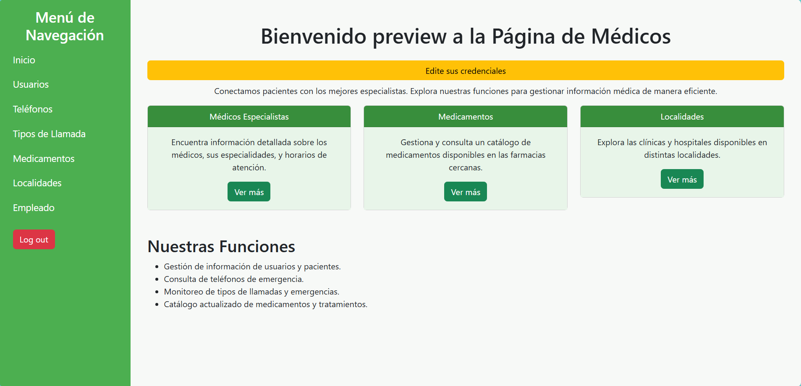
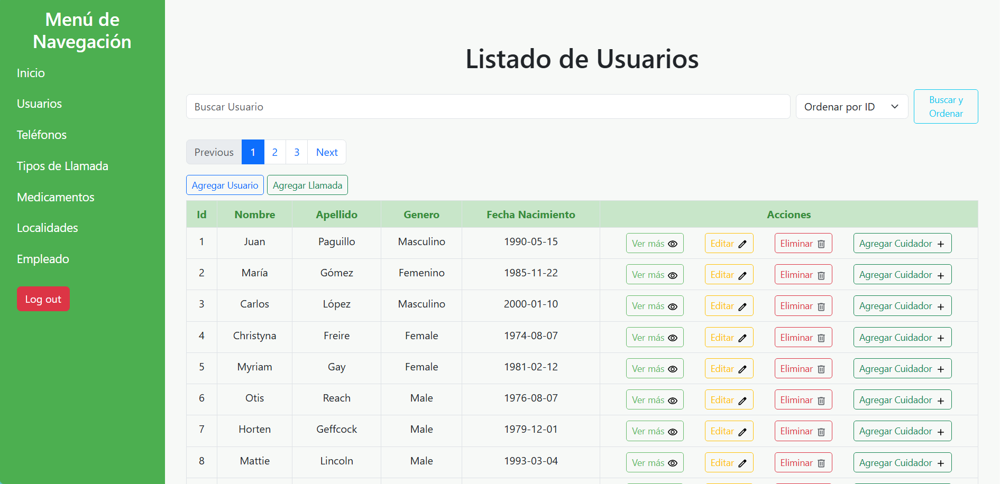
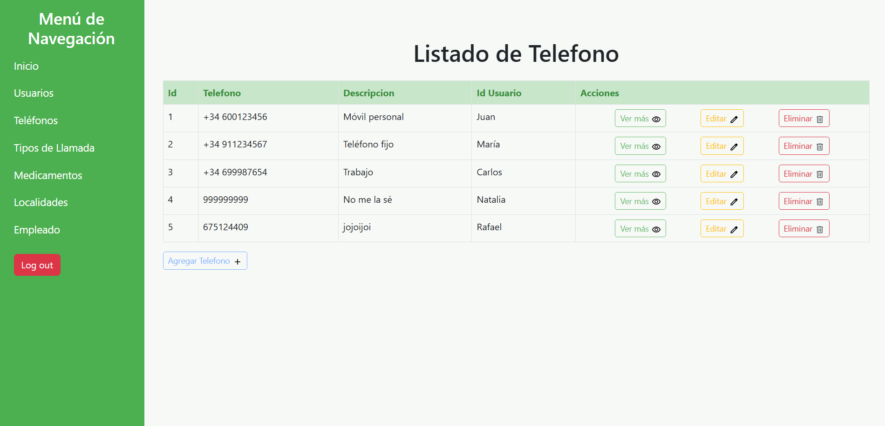
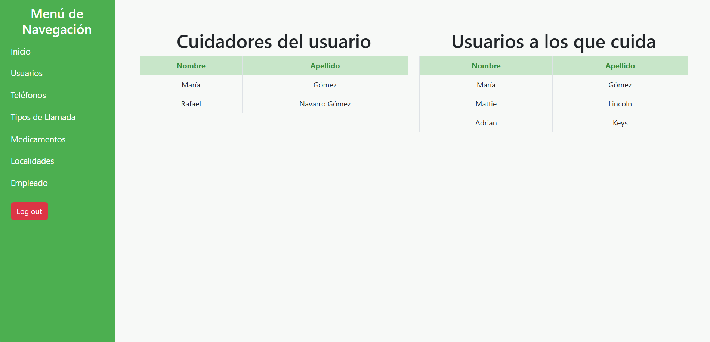

# TeleJaca


A simple SpringBoot project for manage a service for people in a situation of dependence. This project was made for educational purposes


## Installation with Docker

> [!IMPORTANT]
> Is hardly recommended to have installed Docker to run this project

Clone the repository

```git
git clone https://github.com/SoyaR08/TeleJaca.git
```

Go to the project root

```bash
cd TeleJaca
```

Build images & run container

```docker
docker compose up --build
```

To build & run in background

```docker
docker compose up -d --build
```
## Authors

- [@SoyaR08](https://github.com/SoyaR08)
- [@Adrian140604](https://github.com/Adrian140604)
- [@Antonio1004](https://github.com/Antonio1004)
- [@Hugoorgaz](https://github.com/Hugoorgaz)

## Tech Stack

**Client:** SpringBoot, Bootstrap

**Server:** Docker

**Database:** MySql


## Screenshots










## Project Structure
```
src
├── .gitignore
├── main
│   ├── java
│   │   └── com
│   │       └── AtencionSocioSanitaria
│   │           ├── AtencionSocioSanitariaApplication.java
│   │           ├── controller
│   │           │   ├── CareController.java
│   │           │   ├── ControllerLlamada.java
│   │           │   ├── ControllerLogin.java
│   │           │   ├── ControllerMedicamento.java
│   │           │   ├── ControllerTelefono.java
│   │           │   ├── ControllerUser.java
│   │           │   ├── EmpleadoController.java
│   │           │   ├── LocalidadController.java
│   │           │   ├── MedicamentoController.java
│   │           │   └── TiposLlamadaController.java
│   │           ├── model
│   │           │   ├── Baja.java
│   │           │   ├── CuidadorId.java
│   │           │   ├── Empleado.java
│   │           │   ├── Es_cuidador.java
│   │           │   ├── Llamada.java
│   │           │   ├── LlamadaId.java
│   │           │   ├── Localidad.java
│   │           │   ├── Medicamento.java
│   │           │   ├── Rol.java
│   │           │   ├── Telefono.java
│   │           │   ├── Tipos_llamada.java
│   │           │   └── Usuario.java
│   │           ├── repository
│   │           │   ├── CuidadorRepository.java
│   │           │   ├── EmpleadoRepository.java
│   │           │   ├── LlamadaRepository.java
│   │           │   ├── LocalidadRepository.java
│   │           │   ├── MedicamentoRepository.java
│   │           │   ├── TelefonoRepository.java
│   │           │   ├── TiposLlamadaRepository.java
│   │           │   └── UsuarioRepository.java
│   │           ├── security
│   │           │   └── SecurityConfig.java
│   │           └── services
│   │               ├── CuidadorServices.java
│   │               ├── EmpleadoServices.java
│   │               ├── LlamadaServices.java
│   │               ├── LocalidadServices.java
│   │               ├── MedicamentoServices.java
│   │               ├── TelefonoServices.java
│   │               ├── TiposLlamadaServices.java
│   │               └── UsuarioServices.java
│   └── resources
│       ├── application.properties
│       ├── static
│       │   └── css
│       │       ├── form.css
│       │       └── style.css
│       └── templates
│           ├── addcare.html
│           ├── editEmpleadoDetails.html
│           ├── forbidden.html
│           ├── formEmpleado.html
│           ├── formLlamada.html
│           ├── formMedicamento.html
│           ├── formTelefono.html
│           ├── formUsuario.html
│           ├── help.html
│           ├── index.html
│           ├── listCalls.html
│           ├── listEmpleado.html
│           ├── listMedicamento.html
│           ├── listTelefono.html
│           ├── listTiposllamada.html
│           ├── listUser.html
│           ├── listcare.html
│           ├── listlocalidades.html
│           ├── login.html
│           ├── logout.html
│           ├── optionsTiposLlamada.html
│           ├── paginaBien.html
│           ├── paginaFallo.html
│           ├── paginaMal.html
│           ├── partials
│           │   └── navbar.html
│           └── userPhones.html
└── test
    └── java
        └── com
            └── AtencionSocioSanitaria
                └── AtencionSocioSanitariaApplicationTests.java
```

